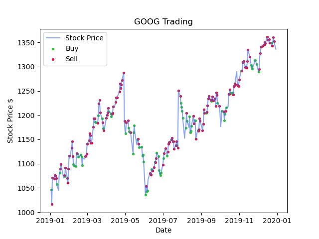

# Overview

The aim of this project is to impliment Deep Q Learning to trade apple stocks. 

## Introduction

In Reinforcment Learning an *agent* makes *observations* and takes *actions* within an *enviroment* in order to achieve *rewards*. In this project we apply the technqiues of RL to stock market trading. In particular, for each of the terms, we use real quantities:

- *Agent*: This will be a our trading bot
- *Observations*: These will be the previous `n_days` of stock prices as well as the agent's current invatory of stocks.
- *Actions*: 
	- The agent can buy, sell or hold any stocks in its inventory. 
	- The agent will, at most, trade one stock per day.
	- The agent can only sell stocks that it already owns, i.e. no short selling. 
- *Enviroment*: Stock prices 
- *Rewards*: The change in profit/loss of a given action 

To train this agent, we will use Deep Q Learning, first developed by deepmind (Mnih et al 2013). There are two parts to this name:

- **Q-learning**: The Q function represents the quality of an action (measured by the final award recived) taken at a give state, i.e. its a function $Q:\mathcal{S}\times \mathcal {A}\to \mathbb{R}$. To iterate on this we use the Bellman equation. 
- **Deep**: Instead of using a table to represent this function, we use a neural net.

Once we have estimate Q, we can then find the set of actions that best maximise the final reward.  

## Results

I trained on `GOOG` stock data and evaulated it on 2019 data. We found 
- Annualised Returns: 6.9%
- Percentage of profitable trades: 63.9%

We plot the stock price along with the days that we bought/sold the stock below. 

Looking at the distribution of profits from each trade, I think that the agent could be imporved by being able to buy/sell multiple stocks on the same day.

## Acknowledgements

- [Git hub for inspiration](https://github.com/pskrunner14/trading-bot)

## References

- [Mnih, Volodymyr, et al. "Playing atari with deep reinforcement learning." arXiv preprint arXiv:1312.5602 (2013).](https://arxiv.org/abs/1312.5602)
- Géron, Aurélien. Hands-on machine learning with Scikit-Learn, Keras, and TensorFlow. "O'Reilly Media, Inc.", 2022. 